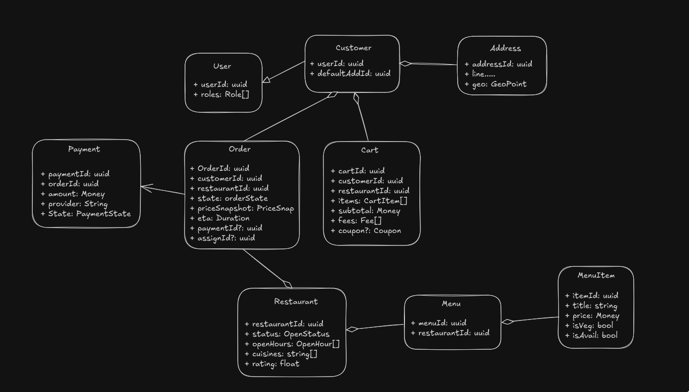

# 1. Requirements
## 1.1 Functional Requirements
- User Onboarding and Authentication
- Browse Restaurants and Menus
- Add MenuItems to Cart
- Applies Coupon
- Select Address
- Checkout and Pay
- Track Status of order
- Restaurant can Add menu
- Accepts order/ Prepares/ Dispatch order
- Customer Support

## 1.2 Core Functionalities
- User Flow: User Sign in/up, browse restaurant, add menu items to cart, Cheks out paying for it.
- Restaurant flow: Registers, Manages Menu, receives order, update status, sends to rider, rider delivers, notification sent, waits for rating.
- Cancel flow: User cancels order, ticket raised, assigns to customer support, restaurant informed, refund/conclusion, ticket closed. 

# 2. Core Entities
- User
- Address
- Restaurant
- Menu
- MenuItems
- Order
- Cart
- Payment
- Coupon
- OrderItem
- Rating
- Refund
- RestaurantService
- PaymentProcessor
- CustomerSupportService

# 3. Class Diagram
