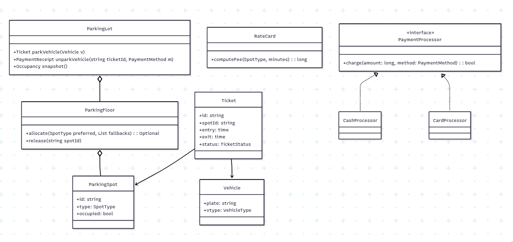
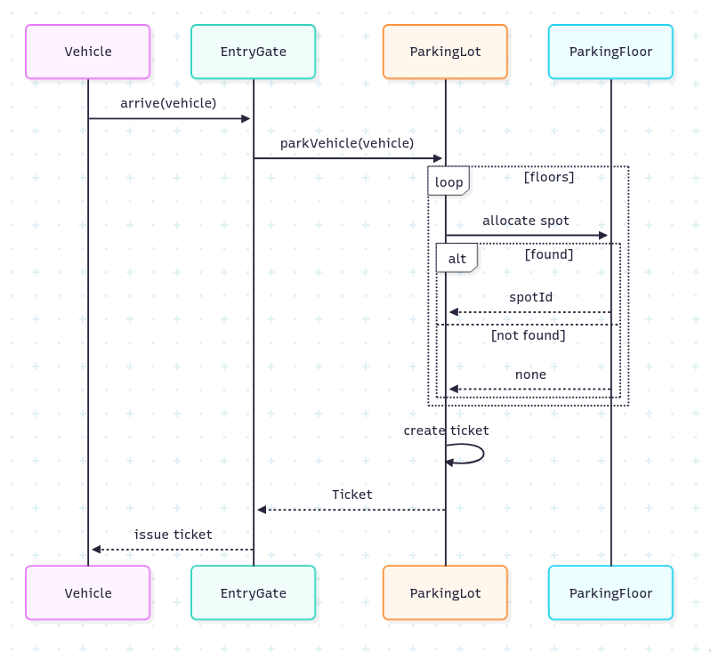

# 1. Requirements
## 1.1 Functional Requirements
- Multiple floors
- Different types of vehicles
- Electric Charging points
- At entry, assign spot automatically and generate ticket
- At exit, process payment and free spot
- Track revenue and occupancy reports

## 1.2 Core Functionalities
- Entry Flow: Vehicle arrives, system finds the nearest available spot, assigns it, and generates a ticket.
- Exit Flow: Vehicle arrives at exit, system calculates parking duration, processes payment, and frees the spot.
- Admin Functions: Occupancy tracking, revenue reports, and lost ticket handling.

## 1.3 Non-Functional Requirements
- Spot assignments should be atomic to avoid race conditions and ensure data integrity.
- Should scale to many vehicles concurrently entering and exiting.
- Must be extensible to add new vehicle types or spot types in the future.
- High availability and fault tolerance to ensure continuous operation.

# 2. Core Entities
- ParkingLot
- ParkingFloor
- ParkingSpot
- Vehicle
- Ticket
- RateCard
- PaymentProcessor
- EntryGate
- ExitGate

# 3. Class Diagram

# 4. Sequence Diagram
## 4.1 Entry Flow
